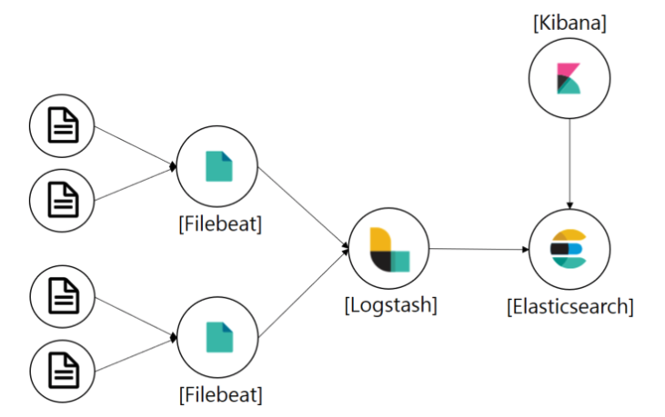
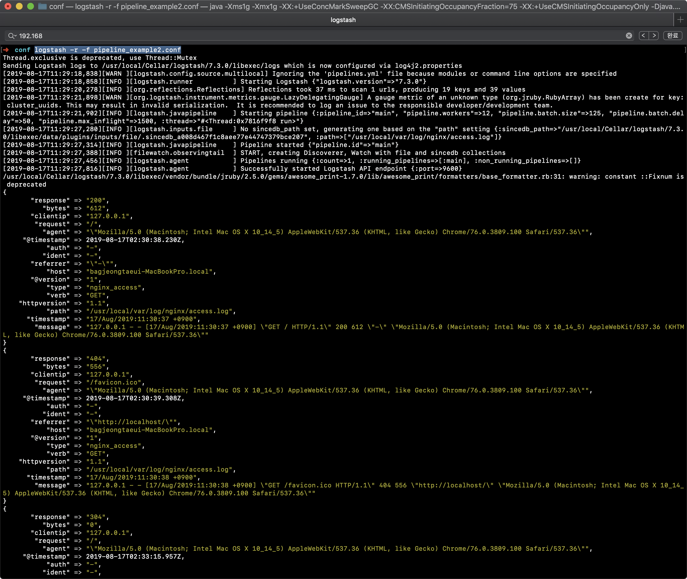
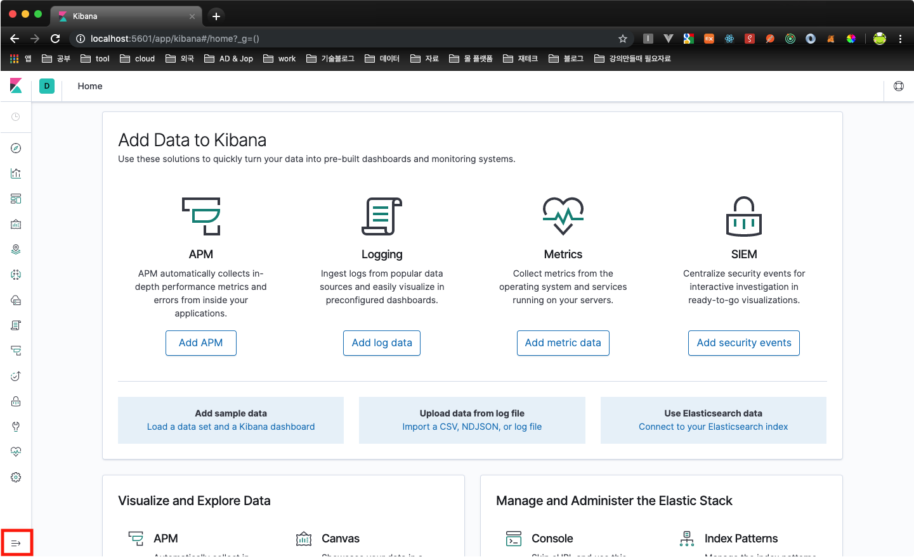
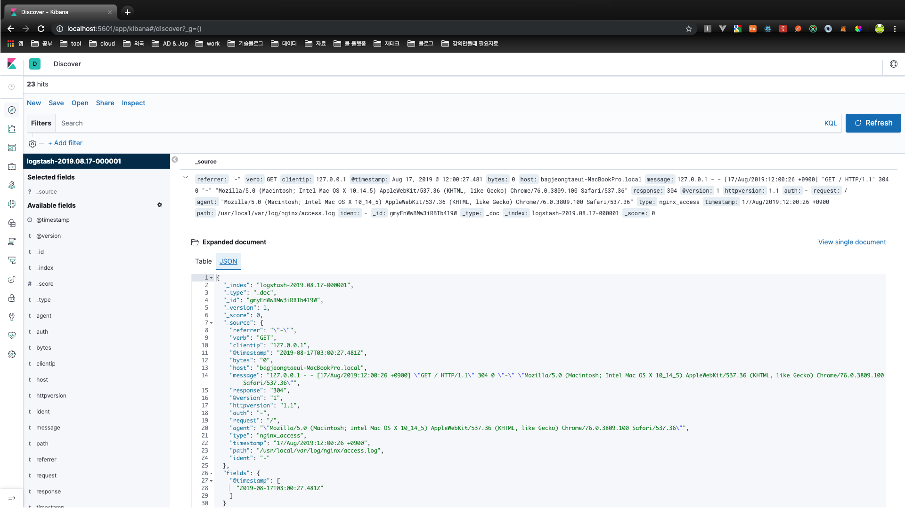

# ELK 시스템 구축

nginx 기반 로깅 시스템 구축

0. ELK 구조
1. 설치
   1. logstash
   2. ElasticSearch 설치
   3. Kibana 설치
   4. docker-compose
2. logstash 파이프라인 생성
3. 로깅내용 elasticsearch 전달
4. kibana 
5. 로그 발생기(node.js - nginx 접속)
6. logstash input {tcp} 사용

# 다양한 시스템 연동 및 개발

1. [mongodb 연동](https://github.com/pjt3591oo/ELK-system/blob/master/document/mongodb.md)


## 0. ELK Architecture



해당 가이드에서는 Filebeat을 사용하지 않고 logstash의 input {file} 기능을 활용.

## 1.  설치

도커를 활용하여 입맛에 따라 적절히 설치한다.

### 1.1 logstash 설치

```bash
$ brew update
$ brew tap adoptopenjdk/openjdk
$ brew cask install adoptopenjdk8
$ brew install logstash
```

logstash는 바이너리 파일을 로컬에 직접 설치한다. logstash는 의존성 때문에 jdk8버전이 필요하다.

만약, 실수로 다른버전을 설치했다면 다음 명령어로 삭제할 수 있다.

**```$ brew cask uninstall java```**


### 1.2. Elastic search 설치 & 실행

```bash
$ docker run -d --name elasticsearch --net somenetwork -p 9200:9200 -p 9300:9300 -e "discovery.type=single-node" elasticsearch:7.3.0
```

elasticsearch는 도커를 활용하여 설치한다.


### 1.3. Kibana 설치 & 실행

```bash
$ docker run -d --name kibana --net somenetwork -p 5601:5601 kibana:7.3.0
```

### 1.4. docker-compose

매번 docker run을 이용하여 컨테이너를 생성하는 방법은 관리적인 측면에서 매우 불편합니다. docker-compose를 이용하면 효율적인 관리를 할 수 있습니다.

* docker-compose.yaml

```yaml
version: '2.2'

networks:
  somenetwork:

services:
  elasticsearch:
    container_name: elasticsearch
    image: elasticsearch:7.3.0
    environment:
      - discovery.type=single-node
    networks:
      - somenetwork
    ports:
      - 9200:9200
      - 9300:9300
    stdin_open: true
    tty: true

  kibana:
    container_name: kibana
    image: kibana:7.3.0
    networks:
      - somenetwork
    ports:
      - 5601:5601
    stdin_open: true
    tty: true
    depends_on:
      - elasticsearch
```

* 컨테이너 생성 및 실행

```bash
$ docker-compose up

$ docker-compose up -d # 데몬(background) 실행
```

```bash
$ docker-compose down # 컨테이너 내리기
```

## 2. logstash 파이프라인생성

logstash는 input -> filter -> output 과정을 거쳐 정제된 데이터(log)를 생성한다.


### 2.1. logstash simple pipeline create

```bash
$ logstash -e 'input { stdin { } } output { stdout {} }' 
Thread.exclusive is deprecated, use Thread::Mutex
Sending Logstash logs to /usr/local/Cellar/logstash/7.3.0/libexec/logs which is now configured via log4j2.properties
[2019-08-17T10:48:59,445][WARN ][logstash.config.source.multilocal] Ignoring the 'pipelines.yml' file because modules or command line options are specified
[2019-08-17T10:48:59,467][INFO ][logstash.runner          ] Starting Logstash {"logstash.version"=>"7.3.0"}
[2019-08-17T10:49:00,836][INFO ][org.reflections.Reflections] Reflections took 64 ms to scan 1 urls, producing 19 keys and 39 values 
[2019-08-17T10:49:02,766][WARN ][org.logstash.instrument.metrics.gauge.LazyDelegatingGauge] A gauge metric of an unknown type (org.jruby.RubyArray) has been create for key: cluster_uuids. This may result in invalid serialization.  It is recommended to log an issue to the responsible developer/development team.
[2019-08-17T10:49:02,773][INFO ][logstash.javapipeline    ] Starting pipeline {:pipeline_id=>"main", "pipeline.workers"=>12, "pipeline.batch.size"=>125, "pipeline.batch.delay"=>50, "pipeline.max_inflight"=>1500, :thread=>"#<Thread:0x59eb46b6 run>"}
[2019-08-17T10:49:07,852][INFO ][logstash.javapipeline    ] Pipeline started {"pipeline.id"=>"main"}
The stdin plugin is now waiting for input:
[2019-08-17T10:49:07,917][INFO ][logstash.agent           ] Pipelines running {:count=>1, :running_pipelines=>[:main], :non_running_pipelines=>[]}
[2019-08-17T10:49:08,181][INFO ][logstash.agent           ] Successfully started Logstash API endpoint {:port=>9600}
```

해당 예제는 filter없이 표준입출력을 이용하여 input 그대로 output하는 파이프라인이다. `$ logstash -e 'input{} filter{ }output {}'` input, filter, output 설정 후 실행하면 잠시후 Successfully 메시지가 뜬다. 해당 메시지가 뜬 후 hello world를 입력해보자!

```bash
hello world
/usr/local/Cellar/logstash/7.3.0/libexec/vendor/bundle/jruby/2.5.0/gems/awesome_print-1.7.0/lib/awesome_print/formatters/base_formatter.rb:31: warning: constant ::Fixnum is deprecated
{
          "host" => "bagjeongtaeui-MacBookPro.local",
      "@version" => "1",
       "message" => "hello world",
    "@timestamp" => 2019-08-17T01:53:07.014Z
}
```


### 2.2. 설정파일

* 설정파일 생성

```bash
$ mkdir conf
$ cd conf
$ vim pipeline_example1.conf
```


* pipeline 정의

pipeline_example1.conf에 다음과 같이 정의한다.

```conf
input { 
  stdin { } 
} 

output {
  stdout { codec => rubydebug }
}
```

> 참고. 필자는 *.conf 파일에서 {} 사이에 엔터를 넣을경우 실행시 바로 shut down이 되었다.

codec => rubydebug는 출력 결과를 `json형태`로 출력하는 플러그인


* logstash 실행

```bash
$ logstash -f pipeline.conf
```


### 2.3. 그럴듯한 파이프라인 만들기

앞선 예제에선 간단한 파이프라인을 이용했다. 이번 예제에서는 좀 더 그럴듯한 파이프라인을 만들어보자.

* 파이프라인 설정

```bash
$ cd conf
$ vim pipeline_example2.conf
```

```
input { 
  file { 
    type => nginx_access 
    path => ["/usr/local/var/log/nginx/access.log"] 
  } 
} 

filter { 
  grok { 
      match =>{"message" => "%{COMBINEDAPACHELOG}" } 
  } 
  mutate { remove_field => [ "message"] }
} 

output {
  stdout { codec => rubydebug }
}
```

해당 패턴은 nginx의 access.log 파일을 받아서 분석하는 내용이다.

input의 file 경로에서 path는 시스템마다 nginx 로그파일 위치가 다를수 있다. 해당 내용은 Mac Os 기준

`grok { }`는 특정 패턴에 따라 필터링한다. `COMBINEDAPACHELOG`는 아파치 로그 패턴에 맞춰서 필터링 한다는 의미

filter의 `mutate { remove_filed }`는 필터링된 결과에서 특정 컬럼을 제거한다. message는 필터링 되기 전의 원문 데이터를 저장하고 있는데 이는 중복저장이기 때문에 지워도 무난하다.

| 만약, input{file}아 아닌 Filebeat를 사용한다면 다음과 같이 input을 만들 수 있다.

```
input { beats { port => "5044" } }
```

5044를 listen하여 Filebeat한테 데이터를 입력받을 수 있다.

* 실행

```bash
$ nginx
$ logstash -r -f pipeline_example2.conf
```

파이프라인을 실행하기 전에 nginx도 함께 실행해준다. 모든 실행이 완료되면 http://localhost을 접속해본다.



> 참고. logstash 실행시 몇가지 옵션이 있는데 -r은 reload를 의미. -f로 전달한 설정파일이 변경되면 자동으로 재시작을 한다.

이제 해당 내용을 elasticsearch로 전달해보자.


## 3. 로깅내용 elasticsearch 전달

* elasticsearch 실행

```bash
$ docker run -d --name elasticsearch --net somenetwork -p 9200:9200 -p 9300:9300 -e "discovery.type=single-node" elasticsearch:7.3.0
```


* docker container log monitor

```bash
$ docker logs -f  elasticsearch   # docker logs -f [CONTAINER NAME]
```


* pipeline 설정

```
input { 
  file { 
    type => nginx_access 
    path => ["/usr/local/var/log/nginx/access.log"] 
  } 
} 

filter { 
    grok { 
        match =>{"message" => "%{COMBINEDAPACHELOG}" } 
    } 
} 

output { 
    elasticsearch { hosts => ["192.168.50.5:9200"] } 
    stdout { codec => rubydebug } 
} 
```

output에서 elasticsearch를 이용하여 filter된 데이터를 elasticsearch로 전송할 수 있다.

hosts =>는 해당 시스템의 IP와 PORT를 넣어준다.

앞에서 `-r` 옵션을 넣었다면 -f로 전달한 설정파일을 수정 후 저장하면 자동으로 재시작한다. 

재시작 후 localhost를 다시 접속해보자!


* elasticsearch 조회

아마 elasticsearch에 아무런 로그가 출력되지 않을겁니다. 

음… 여기서 elasticsearch에서 어디에 어떻게 저장되는지 알 기 위해 다음 명령어를 이용하여 logstash에서 발생된 데이터가 어떤 index에 저장되는지 알 수 있습니다.

```bash
$  curl -XGET 'localhost:9200/_cat/indices?v'

health status index                      uuid                   
green  open   .kibana_task_manager       DggHCb6hSk6J6t_zMrh35A
yellow open   logstash-2019.08.17-000001 9As1VnFVSK6_HI2-eRj7BA
green  open   .kibana_1                  K85ZiB2MRzuudSvenwtXbg
```

컬럼이 좀 더 있지만 깔끔히 보기 위해 uuid 까지만 작성했습니다. 각 index의 크기에 size가 있는데 locahost에 계속 접속 후 다시 해당 명령어를 수행하면 size가 조금씩 증가되는 것을 확인할 수 있습니다.

```bash
$ curl -XGET 'localhost:9200/logstash-2019.08.17-000001/_search?pretty&q=response=304'
```


index와 column인 response를 이용하여 조회할 수 있습니다.


## 4. kibana 

* kibana 실행

```bash
$ docker run -d --name kibana --net somenetwork -p 5601:5601 kibana:7.3.0
```

http://localhost:5601로 접속




좌측 하단의 버튼을 누른 후 discover를 누르면 다음과 같은 페이지로 이동한다.




## 5. 로그 발생기

강제로 localhost를 접속하여 로그를 발생합니다.

* client 생성(./client/webserver/app.js)

```bash
$ mkdir client ; cd client
$ mkdir webserver; cd client
$ npm init
$ npm install --save request
$ npm install --save request-promise
$ vim app.js
```

```javascript
const rp = require('request-promise');

const options1 = {
  method: 'GET',
  uri: 'http://localhost/test/1',
  json: true 
};

const options2 = {
  method: 'GET',
  uri: 'http://localhost',
  json: true 
};

const options3 = {
  method: 'GET',
  uri: 'http://localhost/test',
  json: true 
};

(async () => {
  setInterval(async () => {
    try {
      const res1 = await rp(options1)
    } catch (err) {
  
    }
  
    try {
      const res2 = await rp(options2)
      console.log(res2)
    } catch (err) {
  
    }
  
    try {
      const res3 = await rp(options3)
    } catch (err) {
  
    }
  }, 600)

})()
```

* client 실행

```bash
$ node app.js
```

logstash는 지속적으로 nginx의 access.log를 감시하여 필터링후 elasticsearch에게 전달하며 kibana를 통해 elasticsearch에 저장된 데이터를 분석할 수 있다.

## 6. logstash input {tcp} 사용

logstash는 파일뿐 아니라 tcp를 이용하여 데이터를 받을 수 있습니다.


* pipeline 설정(pipeline_example3.conf)

```
input { 
  tcp {
    port => 12345
    codec => json
  } 
} 

output {
  stdout {  }
}
```

해당 가이드에서는 node.js, python에서 사용법을 알아봅니다.

* node.js (./client/send_logstash/app.js)

```bash
$ npm install --save winston
$ npm install --save winston-logstash
```

```javascript 
const winston = require('winston');
require('winston-logstash');
 
const Logger = function Logger() {
    this.logger = new (winston.Logger)({
        transports: [
            new (winston.transports.Logstash)({
                port: 12345,
                localhost: 'localhost',
                level: 'debug'
            })
        ]
    });
 
    // Logs an info message
    this.logInfo = function(message,  callback) {
      const _this = this;
      _this.logger.log('info', {message: message}, {stream: 'log'}, callback);
    }

    this.logDebug = function(message, callback) {
      const _this = this;
      _this.logger.debug('debug', {message: message}, {stream: 'debug'}, callback);
    }

};

l = new Logger()

l.logInfo('test-info')
```

* 실행

```bash
$ logstash -r -f pipeline_example3.conf
```

```bash
$ node ./client/send_logstash/app.js
```

* 결과 

```bash
{
    "@timestamp" => 2019-08-17T23:55:03.341Z,
         "label" => "node",
       "message" => "{ message: 'test-info' } { stream: 'log' }",
      "@version" => "1",
         "level" => "info",
          "host" => "localhost",
          "port" => 58237
}
```

---

* python (./client/send_logstash/app.py)

```bash
$ pip install python-logstash
$ pip3 install python-logstash
```

```python
import logging
import logstash
import sys

host = 'localhost'

test_logger = logging.getLogger('python-logstash-logger')
test_logger.setLevel(logging.INFO)
# test_logger.addHandler(logstash.LogstashHandler(host, 12345, version=1))
test_logger.addHandler(logstash.TCPLogstashHandler(host, 12345, version=1))

# test_logger.error('python-logstash: test logstash error message.')
# test_logger.info('python-logstash: test logstash info message.')
# test_logger.warning('python-logstash: test logstash warning message.')

# add extra field to logstash message
extra = {
    'test_string': 'python version: ' + repr(sys.version_info),
    'test_boolean': True,
    'test_dict': {'a': 1, 'b': 'c'},
    'test_float': 1.23,
    'test_integer': 123,
    'test_list': [1, 2, '3'],
}

test_logger.info('python-logstash: test extra fields', extra=extra)
```

* 실행

```bash
$ logstash -r -f pipeline_example3.conf
```

```bash
$ python3 ./client/send_logstash/app.py
```

* 결과 

```bash
{
       "test_list" => [
        [0] 1,
        [1] 2,
        [2] "3"
    ],
           "level" => "INFO",
       "test_dict" => {
        "a" => 1,
        "b" => "c"
    },
            "port" => 64432,
    "test_boolean" => true,
      "test_float" => 1.23,
        "@version" => "1",
            "path" => "app.py",
      "@timestamp" => 2019-08-18T00:12:54.974Z,
            "tags" => [],
      "stack_info" => nil,
     "test_string" => "python version: sys.version_info(major=3, minor=7, micro=3, releaselevel='final', serial=0)",
    "test_integer" => 123,
         "message" => "python-logstash: test extra fields",
            "type" => "logstash",
     "logger_name" => "python-logstash-logger",
            "host" => "bagjeongtaeui-MacBookPro.local"
}
```