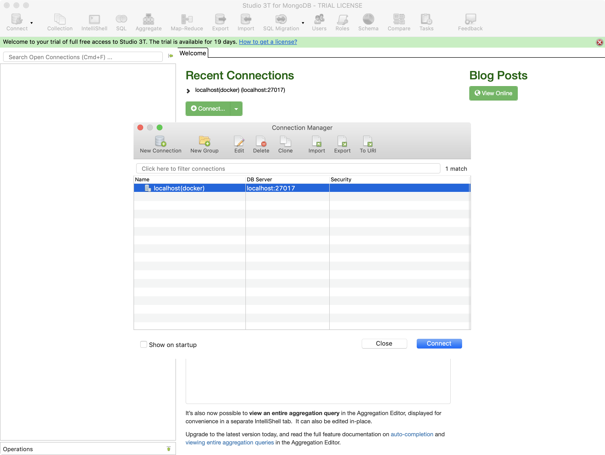
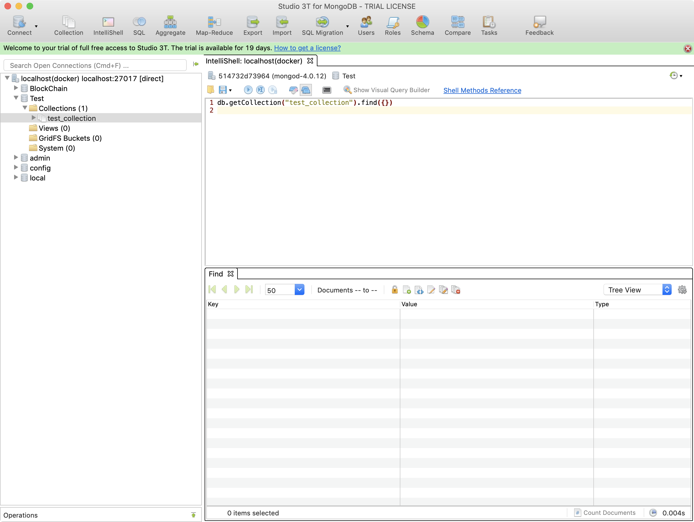
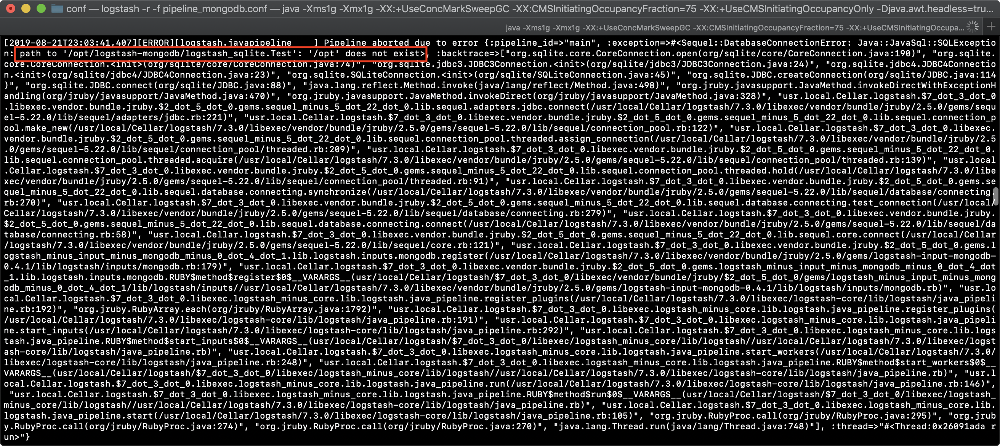
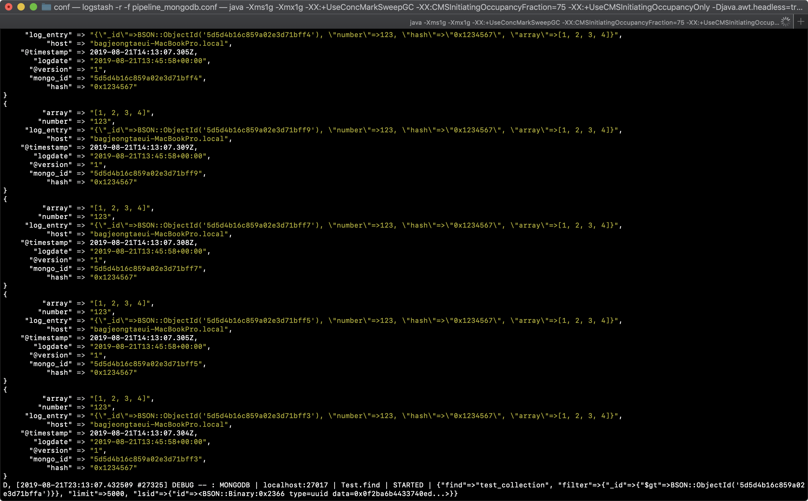

# mongodb 연동

해당 가이드에서는 mongodb에 데이터가 생성되면 logstash에서 elasticsearch로 전달하는 pipeline 시스템을 구축한다.

1. mongodb 설치 및 실행
2. mongodb input plugin 설치
3. mongodb 조작
4. mongodb input pipeline 만들기
5. elasticsearch output pipeline 만들기


## 1. mongodb 설치 및 실행

* docker container 생성

```bash
docker run --name mongo -p 27017:27017 -d mongo
```

또는 docker-compose 파일을 이용하여 실행합니다.

* docker-compose(docker-compose.yaml)

```yaml
version: '2.2'

networks:
  somenetwork:

services:
  elasticsearch:
    container_name: elasticsearch
    image: elasticsearch:7.3.0
    environment:
      - discovery.type=single-node
    networks:
      - somenetwork
    ports:
      - 9200:9200
      - 9300:9300
    stdin_open: true
    tty: true

  kibana:
    container_name: kibana
    image: kibana:7.3.0
    networks:
      - somenetwork
    ports:
      - 5601:5601
    stdin_open: true
    tty: true
    depends_on:
      - elasticsearch

  mongo:
    container_name: mongo
    image: mongo
    networks: 
      - somenetwork
    ports:
      - 27017:27017
    tty: true
    stdin_open: true
```

* docker-compose 실행

```bash
$ docker-compose -f docker-compose up
```

만약, `elasticsearch`와 `kibana` 컨테이너가 이미 존재한다면 다음과 같이 실행할 수 있습니다.

```bash
$ docker-compose -f docker-compose up mongo
```


## 2. mongodb input plugin 설치

logstash에서는 mongodb 플러그인을 이용하여 mongodb에 있는 데이터를 input으로 받을 수 있습니다. 하지만 해당 플러그인은 기본 플러그인이 아니기 때문에 직접 설치가 필요합니다.

* 이미 설치된 플러그인 확인

```bash
$ logstash-plugin list
```

해당 명령어로 설치된 플러그인 목록을 확인할 수 있습니다.

* 플러그인 설치

```bash
$ logstash-plugin install logstash-input-mongodb
$ logstash-plugin install logstash-output-mongodb
```

2개의 플러그인 설치를 했습니다. logstash-input-mongodb는 input을 할 때 사용하는 플러그인이고 logstash-output-mongodb는 output에서 사용하는 플러그인 입니다. 

`$ logstash-plugin list`를 검색하면 해당 플러그인이 설치된것을 확인할 수 있습니다.


## 3. mongodb 조작

앞에서 생성한 mongodb를 전용툴로 접속 후 database, collection 생성후 해당 저장소에 데이터를 저장하는 클라이언트 코드 만드는 방법을 다룹니다.

* mongoldb 접속



해당 툴은 `studio 3T`라는 툴입니다. GUI 툴 또는 cli로 접속하여 다음과 같이 `database`와 `collection`을 생성합니다.

* Database, collection 생성 및 collection 조회



가장 좌측에는 Database와 Collection의 계층적 관계를 보여줍니다. 우측의 상단은 쿼리, 하단은 쿼리 결과를 보여줍니다.

* Database: Test
* Collection: test_collection

mongdodb의 `collection`는 RDB의 `table`과 개념이 비슷합니다.

* Client 코드 만들기 (/client/mongodb/input.py)

이번에는 mongodb로 데이터를 지속적으로 저장하여 지속적으로 데이터를 발생하는 프로그램을 만들어 보겠습니다. 이를 통해 logstash에서 정상적으로 mongodb 데이터를 받아오는지 확인합니다.

```python
import pymongo

__conn = pymongo.MongoClient('127.0.0.1', 27017)

__db = __conn.get_database('Test')
test_collection = __db.get_collection('test_collection')

maxCnt = 10

for idx in range(0, maxCnt):
  test_collection.save({
    'number': 123,
    'hash': '0x1234567',
    'array': [1,2,3,4]
  })
  print('======= %d/%d success'%(idx, maxCnt))
```

```base
$ python ./client/mongodb/input.py
```

해당 코드는 앞에서 생성한 `Database: Test`, `Collection: test_collection`에 `{'number': 123, 'hash': 0x1234567, 'array': [1,2,3,4]}`를 10번 저장하는 코드입니다.


## 4. mongodb input pipeline 만들기

* pileline (/logstash/conf/pipeline_mongodb.conf)

```
input {
  mongodb {
    uri => 'mongodb://localhost:27017/Test'
    placeholder_db_dir => '../'
    placeholder_db_name => 'logstash_sqlite.Test'
    collection => 'test_collection'
    batch_size => 5000
    generateId => false
    parse_method => "simple"
  }
}

output {
  stdout { codec => rubydebug }
}
```

`URI`: mongodb 접속 주소. 마지막 /Test는 database

`placeholder_db_dir`: placeholder_db_name이 저장될 경로. 해당 경로에 있는 파일은 해당 플러그인을 시작하기 위해 필요.

`placeholder_db_name`: 해당 파일은 mongodb와 싱크를 맞추고 있는 파일(해당 부분의 경로가 옳바르지 않다면 실행중 에러가 발생할 수 있습니다.)

`collection`: collection 이름

`parse_method`: 출력방식

`batch_size`: 한번에 저장할 수 있는 크기



~~(사실 해당 에러 찾다가 눈 빠질뻔… )~~

* 실행

```bash
$ logstash -r -f pipeline_mongodb.conf
```



실행을 하게되면 mongodb에 저장된 데이터를 읽어들입니다. 그리고 다시 시작하더라도 한번 읽어들인 데이터를 다시 input으로 받지 않습니다.

* Client 프로그램 실행

```bash
$ python ./client/mongodb/input.py
```


해당 프로그램을 실행하면 logstash는 해당 데이터를 읽어 들여서 input으로 집어넣습니다.

* Client 프로그램 수정 (/client/mongodb/input.py)

Client 프로그램을 약간 수정하고 다시 실행해봅니다.

```python
import pymongo
import time;

__conn = pymongo.MongoClient('127.0.0.1', 27017)

__db = __conn.get_database('Test')
test_collection = __db.get_collection('test_collection')

cnt = 1
while True:
# for idx in range(0, maxCnt):
  test_collection.save({
    'number': 123,
    'hash': '0x1234567',
    'array': [1,2,3,4],
    'timestamp': time.time()
  })
  print('======= %d success'%(cnt))

  cnt += 1
  time.sleep(0.5)
```

해당 코드는 0.5초 간격으로 mongodb에 새로운 데이터를 저장하는 코드입니다. 새로운 데이터가 들어갔는지 구분하기 위해 timestamp를 넣어주었습니다. 

이 부분은 `mongo_id`(`object_id`)를 이용해서도 구분가능합니다.


## 5. elasticsearch output pipeline 만들기

* pileline (/logstash/conf/pipeline_mongodb.conf)

```
input {
  mongodb {
    uri => 'mongodb://localhost:27017/Test'
    placeholder_db_dir => '../'
    placeholder_db_name => 'logstash_sqlite.Test'
    collection => 'test_collection'
    batch_size => 5000
    generateId => false
    parse_method => "simple"
  }
}

output {
  elasticsearch { hosts => ["localhost:9200"] } 
  stdout { codec => rubydebug }
}
```


 [메인으로 가기](https://github.com/pjt3591oo/ELK-system)

